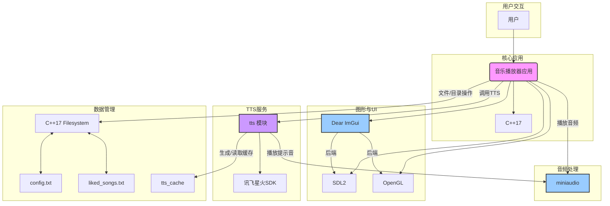

# 音乐播放器

这是一个基于 C++、SDL2、OpenGL 和 Dear ImGui 构建并集成科大讯飞SDK的简单音乐播放器。

## 视频演示

<video src="https://imgcdn.youngqi.cn/video/music-player.mp4"></video>

## 目录

- [项目环境依赖配置](#项目环境依赖配置)
- [编译](#编译)
- [使用](#使用)
- [技术栈](#技术栈)
- [核心逻辑](#核心逻辑)
  - [线程处理](#线程处理)
  - [TTS语音播报](#tts语音播报)
  - [文件读写](#文件读写)
  - [UI 实现](#ui-实现)
  - [资源处理](#资源处理)

## 项目环境依赖配置

本项目使用 CMake 进行构建管理，并依赖以下库：

- **SDL2**: 用于窗口管理、事件处理和图形上下文。
- **OpenGL**: 用于渲染图形。
- **Dear ImGui**: 用于构建用户界面。
- **miniaudio**: 用于音频解码和播放。
- **讯飞星火SDK**: 用于实现文本转语音(TTS)功能。相关的库文件 (`libsparkchain.so`) 和头文件已包含在 `vendor/iflyteksdk` 目录中。

### 前提条件

在编译项目之前，请确保您的系统已安装以下软件：

- **CMake**: 版本 3.10 或更高。
    - [下载 CMake](https://cmake.org/download/)
- **C++ 编译器**: 支持 C++17 标准（例如 GCC, Clang, MSVC）。
- **SDL2 开发库**: 您需要下载并安装 SDL2 的开发库。根据您的操作系统，安装方式可能有所不同：
    - **Windows**: 从 [SDL 官网](https://www.libsdl.org/download-2.0.php) 下载 `Development Libraries (VC)` 版本，并将其包含在您的项目中或系统路径中。
    - **macOS**: `brew install sdl2`
    - **Linux**: `sudo apt-get install libsdl2-dev` (Debian/Ubuntu) 或 `sudo yum install SDL2-devel` (Fedora/RHEL)
- **OpenGL 开发库**: 通常随您的显卡驱动或系统开发工具一同安装。在某些Linux发行版上可能需要安装 `libglu1-mesa-dev` 和 `freeglut3-dev`。

### 配置 `c_cpp_properties.json` (VSCode)

如果您在 VSCode 中遇到头文件找不到的 Linter 错误，请在项目根目录的 `.vscode` 文件夹中创建或更新 `c_cpp_properties.json` 文件，添加正确的 `includePath`。以下是一个示例配置：

```json
{
    "configurations": [
        {
            "name": "Linux",
            "includePath": [
                "${workspaceFolder}/**",
                "${workspaceFolder}/include",
                "${workspaceFolder}/vendor/miniaudio",
                "${workspaceFolder}/vendor/imgui",
                "${workspaceFolder}/vendor/imgui/backends",
                "${workspaceFolder}/vendor/iflyteksdk"
            ],
            "defines": [],
            "compilerPath": "/usr/bin/gcc",
            "cStandard": "c17",
            "cppStandard": "c++17",
            "intelliSenseMode": "linux-gcc-x64"
        }
    ],
    "version": 4
}
````

请根据您的实际 SDL2 和编译器安装路径调整 `includePath` 和 `compilerPath`。

## 编译

本项目使用 CMake 进行编译。请按照以下步骤操作：

1.  **创建构建目录** (在项目根目录执行):

    ```bash
    mkdir build
    cd build
    ```

2.  **运行 CMake 配置** (在 `build` 目录执行):

    ```bash
    cmake ..
    ```

    这会根据您的系统生成相应的构建文件（例如 Makefile 或 Visual Studio 项目文件）。

3.  **编译项目** (在 `build` 目录执行):

    ```bash
    cmake --build .
    ```

    这会编译源代码并生成可执行文件。

## 使用

编译成功后，您可以在 `build` 目录下找到生成的可执行文件（例如 `mp3-player`）。

运行可执行文件，即可启动 MP3 播放器。

  - 启动时，您会听到一声欢迎语音。
  - 当您播放一首新歌时，会先播报一段“现在为您播放由[歌手]演唱的[歌曲]”的提示音，然后再播放歌曲。
  - 程序首次生成提示音时，会在运行目录下创建一个 `tts_cache` 文件夹，用于存放所有生成的语音文件，以避免与您的音乐库混淆。

首次运行时，您可能需要：

1.  在左侧边栏选择"主列表"视图。
2.  在播放列表区域上方的"音乐目录"部分，输入包含您MP3文件的目录路径，然后点击"添加"按钮。
3.  播放器将扫描指定目录下的 `.mp3`, `.wav`, `.flac` 文件并将其添加到播放列表。
4.  双击列表中的歌曲即可播放。

## 技术栈

  - **语言**: C++17
  - **构建系统**: CMake
  - **图形/窗口**: SDL2 (Simple DirectMedia Layer)
  - **渲染 API**: OpenGL
  - **用户界面**: Dear ImGui
  - **音频处理**: miniaudio
  - **TTS服务**: 讯飞星火认知大模型SDK (SparkChain SDK)
  - **文件系统操作**: C++17 `std::filesystem`

### 项目架构



### 执行流程

```mermaid
graph TD
    %% 应用程序启动和初始化
    A[应用程序启动] --> B(初始化核心组件);
    B --> C[初始化SDL/OpenGL/ImGui];
    B --> D[初始化miniaudio];
    B --> E[初始化讯飞TTS SDK];
    B --> F[加载配置 字体 资源];
    F --> G[启动欢迎音播放线程];

    %% 主UI/事件循环
    G --> H[进入主UI 事件循环];
    H --> I[循环: 处理用户事件];
    H --> J[循环: 渲染UI界面];

    %% 用户播放歌曲流程 (在主UI线程触发)
    I -- 用户选择播放歌曲 --> K[调用 PlaySongAtIndex];
    K --> L[检查并准备歌曲播报提示音];
    L --> M{TTS缓存是否存在?};
    M -- 否 --> N[调用讯飞SDK合成TTS音频];
    N --> O[保存TTS音频到tts_cache];
    M -- 是 --> O;
    O -- 阻塞等待 --> P[播放TTS提示音];
    P --> Q[加载并准备选定歌曲];
    Q --> R[启动选定歌曲播放];

    %% miniaudio音频数据回调 (独立线程)
    R -- 音频播放触发 --> S[miniaudio数据回调];
    S --> T[从解码器拉取音频数据];
    T --> U[将数据送至音频设备];
    S -- 继续 --> S; %% 循环拉取

    %% 欢迎音播放线程 (独立于主UI线程)
    G -- 异步执行 --> V[欢迎音线程: 播放 welcome.mp3];
    V --> W[欢迎音线程结束];

    %% 主循环继续
    J --> H; %% UI渲染完成后返回主循环

    %% 核心线程示意 (概览)
    subgraph "核心线程示意"
        X[主UI 事件线程] -- 启动/调用 --> Y[TTS模块];
        Y -- 调用/控制 --> Z[miniaudio播放模块];
        X -- 异步启动 --> AA[欢迎音线程];
        Z -- 内部回调 --> BB[miniaudio回调线程];
    end
```

## 核心逻辑

### 线程处理

本播放器主要通过多个线程协同工作，以确保流畅的用户体验：

  - **主UI线程**: 负责渲染界面、处理用户输入。当需要播放歌曲时，它会调用 `audio` 模块的函数，但在播放TTS提示音时会暂时阻塞。
  - **`miniaudio`音频线程**: 由 `miniaudio` 库在内部管理，负责从解码器拉取音频数据并发送给音频设备。这是通过 `data_callback` 函数实现的，该回调函数在独立的音频线程中运行，并通过互斥锁与主线程安全地共享 `AudioState` 数据。
  - **欢迎音与播报线程**:
      - **欢迎音**: 程序启动时会创建一个分离的 (`detached`) 线程，专门用于在后台播放欢迎语音 (`res/welcome.mp3`)，完全不阻塞UI的加载和响应。
      - **TTS生成与播放**: `playSongAnnouncement` 函数内部包含了生成和播放提示音的逻辑。虽然它本身是在主线程中被调用的（以阻塞歌曲播放），但其内部与讯飞SDK的交互是异步的，并通过 `atomic` 标志位等待合成完成。

### TTS语音播报

本项目集成了讯飞星火认知大模型SDK，实现了自动语音播报功能，以提升用户体验。

  - **模块化设计**: 所有TTS相关的功能都被封装在独立的 `tts` 模块 (`tts.h`, `tts.cpp`) 中，与主程序逻辑解耦。
  - **播报流程**:
    1.  当用户请求播放一首新歌时，`audio` 模块会调用 `tts` 模块的 `playSongAnnouncement` 函数。
    2.  该函数首先根据歌曲的艺术家和标题，生成播报文本（例如“现在为您播放由周杰伦演唱的稻香”）。
    3.  然后，它会根据文本生成一个对应的缓存文件名（例如 `tts_cache/周杰伦-稻香-tip.mp3`）。
    4.  如果缓存文件已存在，则直接进入下一步；如果不存在，则调用讯飞SDK的接口，将文本合成为`.mp3`文件并保存。
    5.  最后，使用 `miniaudio` 以**阻塞**方式播放该提示音。主歌曲的播放流程会一直等待，直到提示音播放完毕后才会继续。
  - **缓存机制**: 所有生成的提示音都会被存储在程序根目录下的 `tts_cache` 文件夹中。这避免了每次播放都重新请求TTS服务，也防止了提示音文件污染用户的音乐目录。

### 文件读写

应用程序通过 `files.cpp` 中定义的函数进行文件读写，主要用于管理音乐目录配置和用户喜爱歌曲列表。

  - **`ScanDirectoryForMusic`**: 遍历指定目录（包括子目录）以查找支持的音乐文件（.mp3, .wav, .flac）。它使用 `std::filesystem` 进行目录遍历，并从文件名中解析艺术家和歌曲标题。
  - **`SaveConfig` / `LoadConfig`**: 负责将用户添加的音乐目录路径保存到 `config.txt` 文件中，或从该文件加载已配置的目录。每个目录路径占据文件中的一行。
  - **`SaveLikedSongs` / `LoadLikedSongs`**: 负责将用户标记为"喜爱"的歌曲路径保存到 `liked_songs.txt` 文件中，或从该文件加载喜爱歌曲的路径。同样，每个歌曲路径占据文件中的一行。

### UI 实现

用户界面通过 [Dear ImGui](https://github.com/ocornut/imgui) 库实现，并使用 SDL2 和 OpenGL 作为后端进行渲染。

  - **`SetModernDarkStyle`**: 设置 ImGui 的视觉风格，使其具有现代深色主题和圆角设计，提升用户体验。
  - **`ShowLeftSidebar`**: 渲染应用程序左侧的导航边栏，允许用户切换主播放列表和喜爱歌曲列表视图。
  - **`ShowPlayerWindow`**: 渲染底部播放器控制区域。这包括当前播放歌曲的标题和艺术家信息、播放控制按钮、歌曲播放进度条、音量控制滑块、播放模式切换以及喜爱/取消喜爱按钮。
  - **`ShowPlaylistWindow`**: 渲染主内容区域的播放列表。在主列表视图下，它还提供了音乐目录管理界面。

### 资源处理

项目中的资源包括音乐文件、字体文件、配置文件和缓存。

  - **音乐文件**: (`.mp3`, `.wav`, `.flac`) 由 `miniaudio` 库负责解码和播放。
  - **字体文件**: `font.ttf` 在应用程序启动时由 ImGui 加载，用于渲染UI中的所有文本，包括中文。
  - **配置文件**: `config.txt` 和 `liked_songs.txt` 文件用于持久化应用程序的音乐目录和用户喜爱歌曲列表。
  - **TTS缓存文件**: 位于 `tts_cache/` 目录下，由程序自动生成和管理。这些是歌曲播报的提示音，以 `[歌手]-[歌名]-tip.mp3` 的格式命名。
